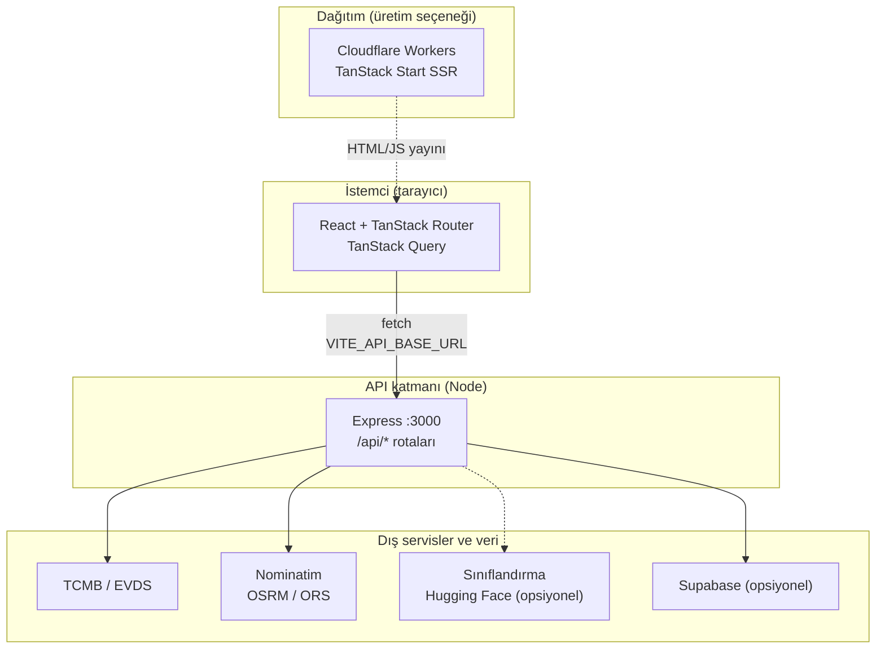
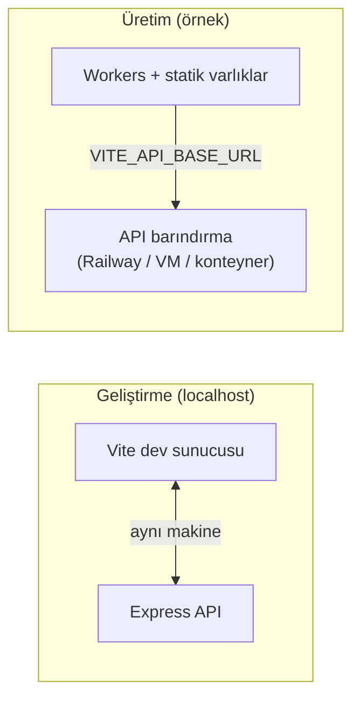

# Tortu

**Tortu**, Kapadokya ve benzeri bölgelerdeki endüstriyel yan ürün ile atık akışlarını dijital vitrine taşıyan, alıcı ve üreticiyi **fiyat**, **rota** ve **karbon** ekseninde aynı ekranda buluşturmayı hedefleyen tam yığın bir web uygulamasıdır. Arayüz; ilan kartları, harita üstü kahraman bölümü, sahadan örnek hikâyeler ve yönetim odaklı sayfalarla ürün diliyle kurgulanmıştır. Sunucu tarafında iş kuralları, dış servis entegrasyonları ve isteğe bağlı kalıcılık katmanı birbirinden ayrılmıştır: tarayıcıda gizli anahtar bulunmaz, tüm hassas yapılandırma ortam değişkenleriyle sunucuda kalır.

Bu belge projenin **ne olduğunu**, **neden** böyle tasarlandığını ve **nasıl** çalıştırılıp üretime taşındığını anlatır; ayrıca üst düzey **mimari diyagramlar** ile bileşenler arası veri akışını görselleştirir.

---

## Proje ne?

Tortu; üreticinin ton bazında stok ve konum bilgisini ilan meta verisiyle birleştirdiği, alıcının ise pazaryerinde gezinirken döviz çevrimi, taşıma mesafesi ve sevkiyat karbonu gibi karar destek sinyallerini aynı kart üzerinde gördüğü bir **döngüsel ekonomi vitrinidir**. Ana sayfa bölgesel kategorileri (örneğin üzüm posası, seramik artığı, volkanik tüf) öne çıkarır; kullanıcıyı pazaryeri, ilan detayı, ilan oluşturma, metodoloji ve profil gibi akışlara yönlendirir. İlan detayında kur marjı, rota tabanlı mesafe ve karbon zinciri gibi hesaplar; backend tarafında normalize edilmiş JSON yanıtlarıyla istemciye iletilir, böylece hem demo hem gerçek API anahtarlı ortamlarda tutarlı bir deneyim hedeflenir.

Uygulama istemcisi **React 19**, **TanStack Router** ve **TanStack Start** üzerinde şekillenir; stil katmanında **Tailwind CSS v4** ve **shadcn/ui** uyumlu bileşenler kullanılır. Harita deneyimi **Leaflet** ile zenginleştirilir; hareketli bölümlerde **Framer Motion** tercih edilir. Veri çekme ve mutasyonlar için **TanStack Query** desenine uyumlu çağrılar `src/lib/api-client.ts` üzerinden yapılır. Kalıcı kullanıcı ve ilan verisi için **Supabase** desteği vardır; ortam değişkenleri eksikse ilgili uçlar kontrollü hata veya fallback ile davranır, böylece hackathon veya değerlendirme ortamında eksik yapılandırmada uygulamanın tamamen çökmesi engellenir.

Özetle Tortu üç yüzü bir arada sunar: çok sayfalı ve erişilebilir **ürün arayüzü**, `/api` altında gruplanmış **Express** REST servisleri ve kur, coğrafya, rota, karbon ile isteğe bağlı **yapay zekâ sınıflandırması** için kullanılan dış kaynaklar. Bu ayrım, hem geliştirici deneyimini hem de güvenlik sınırını netleştirir.

---

## Neden?

Yan ürün ve ikincil hammadde ticaretinde sık görülen sorun, kararın yalnızca birim fiyata indirgenmesidir. Gerçek dünyada alıcı; **güncel kur**, **fiilen kat edilecek yol**, **taşıma modu** ve **raporlanabilir karbon** olmadan sürdürülebilir tedarik iddiasını doğrulayamaz. Üretici tarafında ise ihracat veya yurt içi satışta marjın görünür olmaması, stoğun “ucuz atık” algısında kalmasına yol açar. Tortu bu boşlukları doldurmak için finans, lojistik ve çevre boyutlarını aynı ürün dilinde birleştirir; kullanıcıya tek panelde taranabilir bir karar zemini sunar.

İkinci bir tasarım gerekçesi **dayanıklılıktır**. TCMB kanalı, rota servisleri veya harici sınıflandırma API’leri her zaman yapılandırılmış olmayabilir. Backend; anahtar veya kota eksikliğinde XML tabanlı kur, açık rota örnekleri veya Türkçe anahtar kelime tabanlı sınıflandırma gibi **kademeli fallback** stratejileriyle ayağa kalkmaya devam edecek şekilde yazılmıştır. Bu yaklaşım, canlı demo ve jüri ortamlarında “eksik `.env` yüzünden beyaz ekran” riskini azaltır; üretimde ise tam yapılandırma ile daha isabetli sonuçlar elde edilir.

---

## Nasıl çalışır?

### Geliştirme akışı

1. Bağımlılıkları kurun: `npm install`.
2. `.env.example` dosyasını `.env` olarak kopyalayın. `VITE_API_BASE_URL` istemcinin konuşacağı API kökünü (geliştirmede genelde `http://localhost:3000`), `FRONTEND_ORIGIN` ise CORS için ön yüz kökenini belirler.
3. Tam yığın geliştirme için `npm run dev:all` komutunu kullanın: **Express** varsayılan olarak **3000** portunda, **Vite** geliştirme sunucusu ise ön yüzü ayağa kaldırır. Yalnız API veya yalnız arayüz için sırasıyla `npm run dev:backend` ve `npm run dev` kullanılabilir.
4. İstemci, `api-client` üzerinden JSON istekleri gönderir. Örnek uçlar arasında döviz (`/api/exchange-rates`), rota (`/api/route-distance`), karbon zinciri (`/api/carbon`), ilanlar (`/api/listings`), kullanıcılar (`/api/users`), ürün şeması (`/api/products`), uyumluluk ve iletişim talepleri bulunur.
5. `npm run build` hem istemci üretim paketini hem TanStack Start **SSR / Workers** çıktısını üretir. Bulut dağıtımı için `npm run deploy` (Wrangler ile) kullanılabilir; bu senaryoda ön yüz ve sunucu girişi Cloudflare uyumlu yapılandırmayı takip eder. API katmanı ayrı bir Node süreci veya barındırma hedefi olarak çalışmaya devam eder; istemci `VITE_API_BASE_URL` ile ona bağlanır.

### Ürün özellikleri (özet tablo)

| Alan        | Açıklama                                                |
| ----------- | ------------------------------------------------------- |
| Finans      | TCMB kaynaklı güncel kur; isteğe bağlı EVDS genişlemesi |
| Lojistik    | Araç tipine göre rota; OSRM veya OpenRouteService       |
| Çevre       | Sevkiyat bazlı kg CO₂ ve maliyet zinciri                |
| Harita      | Leaflet ile ilan konumları ve özet görünümler           |
| Operasyon   | Bağımlılık durumu için `api-status` sayfası             |

---

## Mimari diyagramlar

### 1. Sistem bağlamı (istek–yanıt)

Aşağıdaki şema, tarayıcıdaki Tortu istemcisinin Express API’ye nasıl bağlandığını ve API’nin dış dünyayla nasıl konuştuğunu gösterir. Gizli anahtarlar yalnızca API sürecinde bulunur.

**Okuma rehberi:** İstemci yalnızca bilinen REST yüzeyine istek atar. Express katmanı iş kurallarını, basit oran sınırlamasını ve hata normalizasyonunu üstlenir. Supabase yapılandırılmışsa kalıcı profil ve ilan verisi burada tutulur; aksi halde ilgili modüller kontrollü şekilde devre dışı kalır veya anlamlı hata döner.

### 2. Dağıtım ve geliştirme ayrımı

Geliştirmede Vite ve Express yan yana çalışır. Üretimde ön yüz Workers üzerinden servis edilirken, API ayrı bir taban URL ile konfigüre edilir; böylece ölçekleme ve gizli anahtar yönetimi API tarafında yoğunlaştırılabilir.

---

## Teknoloji yığını (kısa)

| Katman    | Seçimler                                              |
| --------- | ----------------------------------------------------- |
| UI        | React 19, TanStack Router & Start, Tailwind CSS 4     |
| Harita    | Leaflet, react-leaflet                                |
| Animasyon | Framer Motion                                         |
| API       | Express 5, CORS, JSON gövde, IP bazlı basit rate cap |
| Dağıtım   | Vite build, Wrangler / Cloudflare uyumluluğu        |
| Veri      | Supabase istemcisi (yapılandırmaya bağlı)             |
| Kalite    | ESLint, Prettier, `node --test` ile backend testleri  |

---

## Dizin yapısı (özet)

| Yol              | Rol                                                         |
| ---------------- | ----------------------------------------------------------- |
| `src/routes/`    | Dosya tabanlı rotalar: ana sayfa, pazaryeri, satış, profil… |
| `src/components/`| Ortak UI: harita, kartlar, üstbilgi, formlar              |
| `src/lib/`       | API istemcisi, auth yardımcıları, örnek ilan verisi       |
| `src/hooks/`     | Kur, konum, karbon zinciri gibi tekrar kullanılan mantık   |
| `backend/`       | `server.js` ve `routes/*.js` altında Express modülleri    |
| `.env.example`   | Zorunlu ve opsiyonel ortam değişkenleri şablonu           |

---

## Komutlar

| Komut                 | Açıklama                              |
| --------------------- | ------------------------------------- |
| `npm install`         | Bağımlılıkları kurar                 |
| `npm run dev`         | Yalnız Vite ile ön yüz geliştirme    |
| `npm run dev:backend` | Yalnız Express API (`node --watch`)  |
| `npm run dev:all`     | Ön yüz + backend birlikte            |
| `npm run build`       | Üretim derlemesi (istemci + SSR)     |
| `npm run deploy`      | Build sonrası Wrangler dağıtımı      |
| `npm run test:backend`| Backend birim testleri               |
| `npm run lint`        | ESLint                               |

---

## Lisans ve katkı

Depo `private` olarak işaretlenebilir; kurumsal veya hackathon sürecindeki lisans koşullarına göre güncellenmelidir. Katkı önerilerinde önce `npm run lint` ve `npm run test:backend` ile yerel doğrulama yapılması önerilir.
