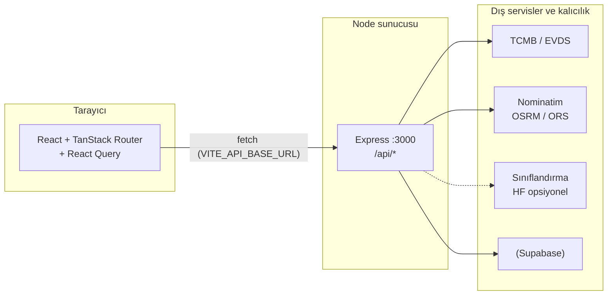

# Tortu

Kapadokya odaklı **döngüsel ekonomi** deneyimi sunan tam yığın web uygulaması. Üreticilerin endüstriyel yan ürün ve artıkları **ton bazında** listeleyebildiği vitrin; alıcı tarafında ise **güncel kur**, **araç rotasına dayalı mesafe** ve **karbon ayak izi** gibi karar destek bileşenleri bir arada sunulur. Proje; React tabanlı arayüz, Node.js (Express) ile yazılmış REST API ve isteğe bağlı Supabase kalıcılığı üzerinde çalışır. Arayüz metinleri ve akışlar “Cave2Cloud / Kapadokya Hackathon 2026” çerçevesinde konumlanmış olsa da kod yapısı genel bir **ürün vitrini + operasyon paneli** rolünü üstlenecek şekilde ayrıştırılmıştır.

---

## Proje ne?

**Tortu**, fiziksel stoğu dijital ilana bağlayan bir platformdur. Ana sayfa bölgesel yan ürün kategorilerini (örneğin üzüm posası, seramik artığı, volkanik tüf) vurgular; **pazaryeri** örnek ve gerçek ilan kartlarıyla listelemeyi destekler; **satış / ilan oluşturma** akışı üretici bilgisini ve ürün meta verilerini backend’e iletir; **ilan detayı** kur çevrimi, rota mesafesi ve CO₂ hesaplarıyla zenginleşir. **Profil** ve **kimlik doğrulama** uçları kullanıcı kaydını API üzerinden yönetir; API anahtarları tarayıcıya gömülmez—tüm gizli anahtarlar sunucu ortamında kalır.

Özetle sistem üç yüzden oluşur: (1) çok sayfalı **TanStack Router** ile örgütlenmiş React istemcisi, (2) `/api/*` altında toplanmış **Express** servisleri, (3) kur, coğrafya ve (yapılandırılmışsa) yapay zekâ sınıflandırma için harici **canlı kaynaklar** veya güvenli **fallback** mantığı.

---

## Neden?

Yan ürün ticareti sık sık **fiyat şeffaflığı** ve **lojistik gerçekçiliği** eksikliğiyle yürür: kur statik kalır, mesafe kuş uçuşu gösterilir, sürdürülebilirlik iddiası ölçülemez kalır. Tortu bu üç boşluğu aynı kart üzerinde kapatmayı hedefler—ihracat düşünen üretici için döviz marjının görünür olması, alıcı için gerçek yol mesafesi ve taşıma moduna göre karbon satırının çıkması, karar sürecini hem ticari hem çevresel boyutta taranabilir kılar.

Hackathon ve demo ortamlarında backend’in **anahtarsız da çalışabilmesi** (örneğin TCMB’nin XML kanalı, OSRM ile rota denemesi, Türkçe anahtar kelime ile atık sınıflandırması) bilinçli bir tasarım seçimidir: jüri veya kullanıcı tarafında eksik `.env` olduğunda uygulama tamamen çökmez; yapılandırma tamamlandığında ise EVDS, OpenRouteService veya Hugging Face ile daha güçlü ve stabil sonuçlar elde edilir.

---

## Nasıl?

### Çalışma modeli

1. Geliştirici `.env` dosyasını `.env.example` üzerinden kopyalar; `VITE_API_BASE_URL` istemcinin konuşacağı backend adresini, `FRONTEND_ORIGIN` ise CORS kökenini belirler.
2. `npm run dev:all` ile Express (varsayılan **3000**) ve Vite geliştirme sunucusu (**5173**) birlikte ayağa kalkar; yalnız arayüz için `npm run dev`, yalnız API için `npm run dev:backend` kullanılabilir.
3. İstemci, `src/lib/api-client.ts` üzerinden JSON istekleri atar; örnek uçlar: döviz (`/api/exchange-rates`), rota (`/api/route-distance`), karbon (`/api/carbon`), ilanlar (`/api/listings`), kullanıcılar (`/api/users`), ürün şeması (`/api/products`), uyumluluk ve iletişim talepleri.
4. Supabase ortam değişkenleri doluysa profil ve kalıcı kayıtlar veritabanına yazılır; değilse backend kontrollü **fallback** veya hata mesajlarıyla davranır—davranış ilgili route dosyalarında netleştirilir.

### Öne çıkan özellikler (ürün diliyle)

| Alan | Açıklama |
|------|-----------|
| Finans | TCMB kaynaklı güncel kur; isteğe bağlı EVDS ile genişletme |
| Lojistik | Araç tipine göre rota; OSRM veya OpenRouteService |
| Çevre | Sevkiyat bazlı kg CO₂ hesabı |
| Harita | Leaflet ile ilan konumları ve görünür özet |
| Operasyon | Canlı bağlantı durumu için `api-status` sayfası |

---

## Mimari diyagram

Aşağıdaki şema üst düzey veri akışını gösterir; istemci yalnızca bilinen REST yüzeyine bağlanır, gizli anahtarlar ve kota dostu mantık sunucuda kalır.

**Katmanların sorumluluğu:** istemci sunum, yönlendirme ve form doğrulaması; API iş kuralları, oran sınırlama, harici çağrıların tekilleştirilmesi ve hata normalizasyonu; Supabase (varsa) uzun ömürlü kullanıcı ve ilan verisi; harici API’ler ise canlı kur, coğrafya ve isteğe bağlı ML sınıflandırması için kullanılır.

---

## Dizin yapısı (özet)

| Yol | Rol |
|-----|-----|
| `src/routes/` | Dosya tabanlı rotalar (`/`, `/marketplace`, `/sell`, `/listing/:id`, `/profile`, `/auth`, …) |
| `src/components/` | Ortak UI (harita, kartlar, üstbilgi…) |
| `src/lib/` | API istemcisi, auth yardımcıları, örnek ilan verisi |
| `backend/` | `server.js` ve `routes/*.js` altında Express modülleri |
| `.env.example` | Zorunlu ve opsiyonel ortam değişkenleri şablonu |

---

## Komutlar

| Komut | Açıklama |
|-------|-----------|
| `npm install` | Bağımlılıkları kurar |
| `npm run dev` | Yalnız Vite ile ön yüz geliştirme |
| `npm run dev:backend` | Yalnız Express API (`node --watch`) |
| `npm run dev:all` | Ön yüz + backend birlikte |
| `npm run build` | Üretim derlemesi |
| `npm run test:backend` | Backend birim testleri |
| `npm run lint` | ESLint |

---

## Lisans ve katkı

Depo özel (`private`) olarak işaretlenmiş olabilir; kurumsal veya hackathon sürecindeki lisans koşullarına göre güncellenmelidir. Katkı önerilerinde önce `backend/tests` ve `npm run lint` ile yerel doğrulama yapılması önerilir.
