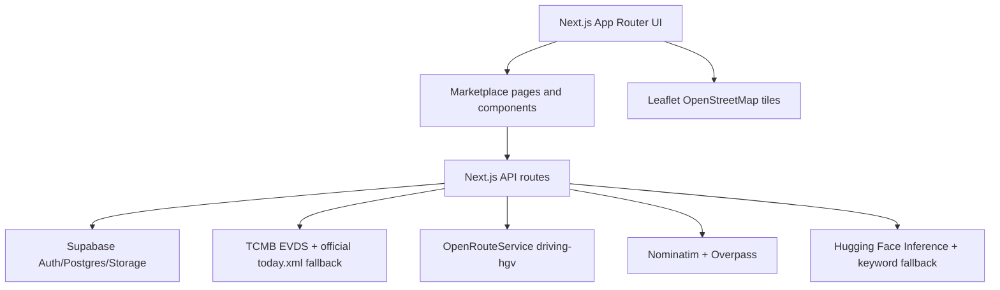

# Tortu — Kapadokya'dan başlayan döngü

Tortu, Kapadokya Hackathon 2026 Cave2Cloud teması için hazırlanmış çok satıcılı bir B2B döngüsel ekonomi marketplace MVP'sidir. Platform, Avanos seramik atölyeleri, Ürgüp bağcılık ve şarap üreticileri, Niğde bakliyat tesisleri, Hacıbektaş tekstil işletmeleri ve Acıgöl perlit/pomza üreticilerinin yan ürünlerini alıcı firmalara açar. Alıcı tarafında geri dönüşüm, kompost, peyzaj, inşaat, sürdürülebilir üretim ve ihracat firmaları vardır. Temel fikir basittir: Bölgede bertaraf maliyeti olarak görülen yan ürünler dijital mağazalara dönüşür; alıcılar ise fiyat, konum, karbon ayak izi ve canlı döviz etkisini aynı ekranda görerek karar verir.

Marketplace mantığı ürünün merkezindedir. Her ilan bir satıcı mağazasına bağlıdır; kartlarda satıcı adı, şehir, miktar, TRY fiyatı, TCMB kuru geldikten sonra USD karşılığı, alıcıya göre yaklaşık mesafe, CO₂ ön hesabı ve ihracat marj rozeti görünür. İlan detayında satın alma talebi, KVKK onaylı iletişim talebi, örnek sertifika PDF'i ve canlı bonus zinciri paneli vardır. Bu yapı jüri demosunda "yalnızca hesap makinesi" değil, iki taraflı pazar olduğunu net gösterir.

## Kayıt, giriş ve demo oturumu

`/login`, `/signup` ve `/onboarding` artık gerçek form akışıyla çalışır. Backend tarafında `/api/auth/login`, `/api/auth/signup`, `/api/auth/onboarding`, `/api/auth/logout` ve `/api/auth/me` route'ları vardır. Supabase URL/anon key tanımlıysa login/signup önce Supabase Auth kullanır. Hackathon demosunda env eksikse sistem demo cookie session'a düşer; böylece jüri karşısında giriş/kayıt akışı kırılmaz. Demo giriş: `buyer1@tortu.app / Tortu2026!`. Kayıt sonrası kullanıcı onboarding'e yönlenir, adresini Nominatim ile koordinata çevirebilir ve profil tamamlanınca dashboard'a geçer.

## Mimari



## Zorunlu kural 1: dinamik coğrafi karbon izi

`/api/route-distance` ve `/api/carbon/calculate` route'ları mesafeyi sunucu tarafında hesaplar. Kara taşıma için `ORS_API_KEY` varsa OpenRouteService `driving-hgv` endpoint'i çağrılır. Anahtar yoksa veya servis hata verirse cevap açıkça `haversine-fallback` kaynağıyla döner; bu bir gizli sabit mesafe değildir, koordinatlardan hesaplanan dinamik fallback'tir. Demiryolu için Haversine x 1.2, deniz ve hava için büyük çember hesabı kullanılır. CO₂ hesabı `distanceKm * weightTon * emissionFactor` formülüyle `lib/carbon.ts` içinde yapılır. Emisyon katsayıları PRD/DOCX referansıyla `air=0.500`, `sea=0.015`, `road=0.100`, `rail=0.030` olarak kodlanmıştır.

## Zorunlu kural 2: TCMB canlı kur ve iş kararına etkisi

`/api/exchange-rates` önce Supabase `exchange_rates` cache'ini okur, sonra TCMB EVDS çağrısı yapar. EVDS anahtarı yoksa veya hata verirse resmi TCMB `today.xml` kullanılır. İki kaynak da başarısızsa eldeki cache `stale: true` ile döndürülür ve UI kırmızı uyarı gösterir. Navbar'daki kur rozeti para birimi çiftini ve son güncelleme saatini gösterir. Marketplace kartlarında ihracat uygun ilanlar için marj rozeti canlı USD/TRY değerine göre değişir: kur değiştiğinde "Marj güçlü", "Marj izlenmeli" veya "Kur riski" sinyali değişir. Kur yüklenmeden USD karşılığı gösterilmez; böylece hardcoded kur kullanılmaz.

## Zorunlu kural 3: karbon zincirinden bağımsız coğrafi veri

Karbon hesabından ayrı olarak `/api/geocode`, `/api/reverse-geocode` ve `/api/overpass` route'ları vardır. Marketplace sayfasındaki "Kayseri çevresi sanayi alanları" paneli Overpass API ile yakındaki endüstriyel alanları arar. Bu işlev karbon maliyeti hesaplamasından bağımsızdır ve DOCX'teki üçüncü kuralı ayrı bir iş akışı olarak karşılar. Onboarding ekranı ise Nominatim tabanlı adres-koordinat dönüşümü için hazırlanmıştır.

## Bonus zincir

İlan detayındaki Karbon Maliyeti Paneli tek butonla üç aşamayı tetikler: mesafe, CO₂, TCMB kuruyla maliyet. Endpoint cevapta `distanceKm`, `emissionFactor`, `co2Kg`, TRY/USD/EUR karbon maliyeti, kur timestamp'i, `sources.distance`, `sources.rates` ve `chain: ["geo","carbon","fx"]` alanlarını döndürür. UI bu ara değerleri gösterir, fallback varsa kaynak etiketiyle açıklar. Jüriye gösterilecek ana teknik an burasıdır.

## Demo akışı

1. Ana sayfada Tortu'nun çok satıcılı Cave2Cloud pazarı olduğu anlatılır.
2. Etki panosunda ton, CO₂ ve üreticiye dönen gelir metrikleri gösterilir.
3. `Giriş` butonuyla demo alıcı hesabına girilir; navbar'da şirket adı görünür.
4. Kayıt akışı ayrıca gösterilecekse yeni hesap oluşturulur, onboarding'de adres geocode edilir ve dashboard'a geçilir.
5. Marketplace sayfasına geçilir; aktif satıcı, açık ilan, ihracata uygun ilan ve ton metrikleri gösterilir.
6. TCMB kur rozeti ve ihracat marj sinyali anlatılır.
7. Overpass panelinde "OSB Ara" butonuyla karbon dışı coğrafi veri işlevi tetiklenir.
8. Avanos seramik ilanına girilir; satıcı mağazası, satın alma talebi ve KVKK iletişim butonları gösterilir.
9. Karbon panelinde "Hesapla" çalıştırılır; mesafe → CO₂ → TCMB kuruyla maliyet zinciri gösterilir.
10. Örnek PDF sertifika indirilir ve karbon cüzdanı sayfası açılır.

## Yerel çalışma

```bash
pnpm install
cp .env.local.example .env.local
pnpm dev
```

Supabase kullanmak için yeni proje açın, `supabase/schema.sql` dosyasını SQL editor'de çalıştırın, email auth provider'ı açın ve `listing-photos` bucket'ının public olduğundan emin olun. Demo hesapları: `producer1@tortu.app`, `producer2@tortu.app`, `producer3@tortu.app`, `buyer1@tortu.app`, `buyer2@tortu.app`, `admin@tortu.app`; tüm parolalar `Tortu2026!`. ORS ve Hugging Face anahtarları demoda daha güçlü görünür, ancak uygulama anahtarsız build ve local demo için kontrollü fallback'lerle çalışır.

## Doğrulama

Beklenen temel doğrulama:

```bash
pnpm lint
pnpm build
curl http://localhost:3000/api/stats
curl -X POST http://localhost:3000/api/carbon/calculate \
  -H 'Content-Type: application/json' \
  -d '{"from":[35.4826,38.7205],"to":[34.848,38.717],"weightTon":2,"mode":"road"}'
curl -i -X POST http://localhost:3000/api/auth/login \
  -H 'Content-Type: application/json' \
  -d '{"email":"buyer1@tortu.app","password":"Tortu2026!"}'
```

Build sonrası `.next/static` içinde `ORS_API_KEY`, `HF_API_KEY`, `TCMB_EVDS_API_KEY` ve `SUPABASE_SERVICE_ROLE_KEY` aranarak client bundle'a secret sızmadığı kontrol edilmelidir.

## Deploy

Vercel'de proje bağlandıktan sonra `NEXT_PUBLIC_SUPABASE_URL`, `NEXT_PUBLIC_SUPABASE_ANON_KEY`, `SUPABASE_SERVICE_ROLE_KEY`, `TCMB_EVDS_API_KEY`, `ORS_API_KEY`, `HF_API_KEY` ve `NOMINATIM_USER_AGENT` env değişkenlerini girin. Ardından `vercel --prod` çalıştırın. Gerçek Vercel hesabı ve servis anahtarları olmadan canlı deploy doğrulanamaz.

## Lisans ve üretim notu

Hackathon prototipi; ticari kullanımdan önce veri doğruluğu, hukuki metinler, KVKK onay kayıtları, ödeme/sipariş statüleri ve üretim RLS politikaları yeniden denetlenmelidir.
